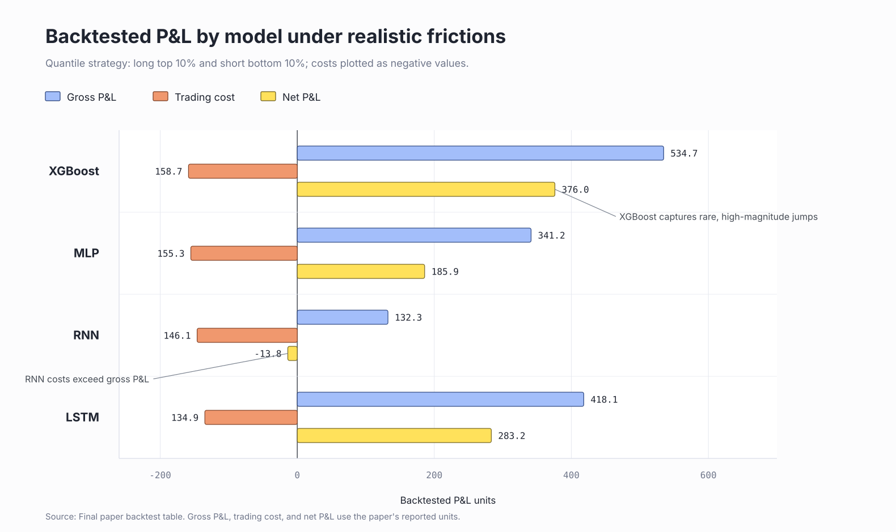

# High-Frequency Limit Order Book Dynamics

## An Evolutionary Machine Learning Approach To Prediction Market Microstructure

This repository is a research showcase for modeling short-horizon price dynamics in high-frequency prediction markets such as Polymarket. The project studies whether fleeting order book inefficiencies can be detected from market microstructure features and converted into tradable signals under realistic frictions.

The central target is the 5-second forward mid-price return:

```text
r_{t, t+5}
```

Rather than predicting the final resolution of a prediction-market contract, this work focuses on localized, short-lived price movements. The research framing is closer to high-frequency liquidity taking or market making than long-horizon directional investing.

The full paper is available at [reports/paper/Final_Paper.pdf](reports/paper/Final_Paper.pdf).

## Research Motivation

Prediction markets are noisy, sparse, and regime-dependent. A model that learns absolute price levels, contract strikes, or macro price states can appear predictive in-sample while failing when the market regime changes. This project therefore reframes the problem around relative-value microstructure signals.

The goal is to answer a narrower question:

Can regime-agnostic order book features identify short-term, tradable mid-price dislocations after accounting for liquidity and transaction costs?

## Data Philosophy

The feature pipeline is built around two principles.

**Regime-Agnostic Features**

Absolute price information is intentionally removed to reduce macro-trend memorization. The feature space emphasizes relative signals:

- Microstructure imbalance, such as micro-price minus mid-price
- Theoretical mispricing, such as deviation from Black-Scholes-Merton value
- Short-horizon momentum and realized volatility

**Tradability Filtering**

The dataset is filtered to avoid learning from market states that would not be realistically tradable:

- Early warm-up periods are removed so rolling metrics can stabilize
- Wide-spread observations are excluded
- Deep in-the-money and out-of-the-money contract states are excluded
- Illiquid or extreme-probability periods are treated as noise rather than alpha

## Modeling Study

The project uses an evolutionary ablation design: each model adds one layer of complexity so the source of predictive signal can be interpreted.

| Model | Role In Study | Key Interpretation |
| --- | --- | --- |
| XGBoost | Cross-sectional baseline | Strong at isolating rare, high-magnitude jumps |
| MLP | Neural cross-sectional model | Tests non-linear feature crossing under gradient descent |
| RNN | Sequential baseline | Tests temporal memory without LSTM-style gating |
| LSTM | 60-second temporal model | Captures order flow dynamics and directional stability |

## Out-Of-Sample Results

Predictive metrics show that standard regression quality is only part of the story. In this setting, rank ordering and tail behavior matter because the trading rule acts only on the strongest signals.

| Model | RMSE | MAE | Rank IC | Directional Accuracy |
| --- | ---: | ---: | ---: | ---: |
| XGBoost | 0.327701 | 0.070471 | 0.1223 | 50.77% |
| MLP | 0.327518 | 0.069295 | 0.2025 | 59.48% |
| RNN | 0.341496 | 0.072100 | 0.1954 | 59.26% |
| LSTM | 0.341964 | 0.072208 | 0.2209 | 60.19% |

## Backtesting Under Frictions

The execution study applies a quantile strategy: long the top 10% of predictions and short the bottom 10%. Fees are modeled with a dynamic market-cost formula:

```text
Fee = P * (1 - P) * C * 0.072
```



| Model | Win Rate | Gross P&L | Trade Cost | Net P&L |
| --- | ---: | ---: | ---: | ---: |
| XGBoost | 42.72% | 534.7090 | 158.7220 | 375.9870 |
| MLP | 50.94% | 341.2103 | 155.3125 | 185.8979 |
| RNN | 49.02% | 132.3487 | 146.1139 | -13.7652 |
| LSTM | 52.16% | 418.0846 | 134.8655 | 283.2191 |

The main finding is an architectural trade-off. XGBoost has a lower post-fee win rate but captures fat-tail events well enough to produce the highest net P&L. LSTM produces stronger directional stability and a higher win rate, suggesting that temporal memory helps filter noisy order flow.

## Research Takeaways

- The prediction target matters: short-horizon mid-price returns are better aligned with microstructure trading than final contract outcomes.
- Relative features reduce regime memorization and make the learning problem more portable.
- Liquidity filtering is not a preprocessing detail; it is part of the research design.
- Global MSE is misaligned with a quantile execution strategy because most training effort is spent on the middle observations that are never traded.
- Future work should explore tail-focused objectives, ranking losses, or ensembles that combine LSTM directional stability with XGBoost extreme-event triggering.

## Repository Contents

```text
notebooks/        Research notebooks for data engineering, feature construction, modeling, and backtesting
reports/paper/    Final paper and supporting manuscript files
reports/figures/  Figures produced during analysis
data/             Local data artifact placeholder; raw parquet files are not committed
models/           Local model artifact placeholder; trained checkpoints are not committed
src/              Minimal shared project utilities
```

This repository is intended as a research record and presentation artifact, not a production software package.
